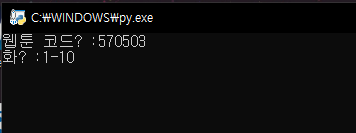
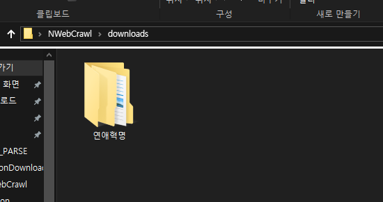
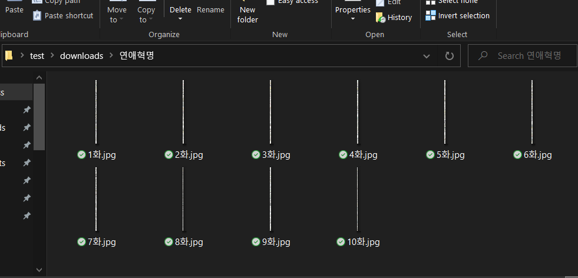

## NToonDownloader
스레드를 사용하지 않고 비동기를 이용하여 적은 메모리로 빠르게 다운로드합니다.

### 사용법
main.py가 있는 곳에 **downloads** 폴더를 만듭니다.

`https://comic.naver.com/webtoon/detail.nhn?titleId=570503&no=291&weekday=thu` 
웹툰 주소에서 **titleId** 파라미터가 웹툰 코드입니다.   
웹툰 코드에 **titleId** 파라미터 값을 입력하고, **화**에는 다운로드 할 화를 입력합니다.  
여러 화도 -로 설정할 수 있습니다. (1-3을 입력하면 1에서 3화를 다운로드합니다.) 

## 예시

## 필요한 모듈
* aiohttp
* aiofiles
* bs4
* PIL

## 주의
다운받으신 웹툰은 **개인적인 용도**로만 사용이 가능하며, **상업적인 용도, 재배포**등은 하실 수 없습니다.  
이 소스 코드를 이용하여 발생하는 문제는 제작자가 책임지지 않습니다. 저작권을 지켜주세요!
